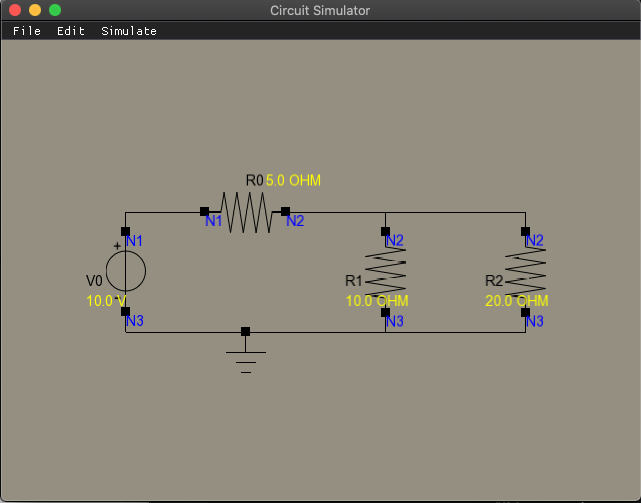

<!---
# Sample README file for C++ programming project

This is an initial git repository for your programming project.
It contains an initial directory structure that we wish you could
use as follows:

  * `plan/` -- Your project plan should be put here. You may use different sources,
    but we hope to get the plan **also as a pdf file**.

  * `doc/` -- The documentation sources related to your project should be put here.
    You may use different tools for documentation (e.g. latex),
    but we hope to get the final version of the document
    **also as pdf file**.

  * `src/` -- Here are the C++ source files. You can have subfolders as needed.

  * `README.md` -- This file. You should modify it to represent
    your project.

You may also add other new directories as needed, for example
for testing tools.
!--->

# Circuit Simulator



Dependencies:

```
cd circuit-sim-2020-2
git submodule update --init --recursive
```

How to run:

```
cd circuit-sim-2020-2
mkdir build
cd build
cmake ..
make
./src/main
```

How to run tests:

```
cd circuit-sim-2020-2
mkdir build
cd build
cmake ..
make
make test
```

How to run individual test for more accurate details:

```
cd circuit-sim-2020-2
mkdir build
cd build
cmake ..
make
cd tests
./circuit
./load_file
./save_file
```

Remove everything from build folder:

```
rm -r *
```
